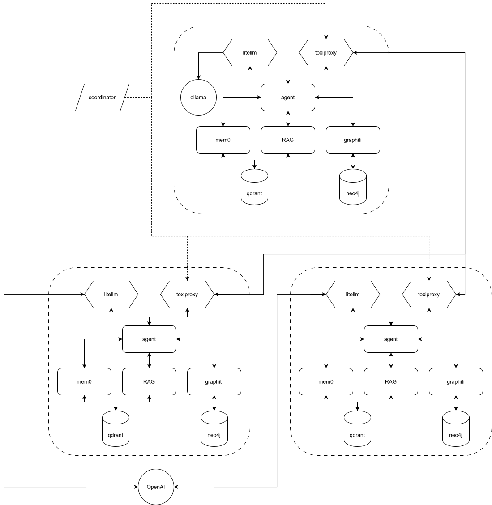

# Cost and accuracy of long-term graph memory in distributed LLM-based multi-agent systems

A distributed multi-agent system testbed for benchmarking vector-based vs. graph-based long-term conversational memory in different network scenarios.

<p align="center">
  
</p>

## Overview

This project compares two approaches to persistent memory in LLM-based multi-agent systems:

| Approach          | Backend                                        | Storage | Search Method            |
| ----------------- | ---------------------------------------------- | ------- | ------------------------ |
| **Vector Memory** | [mem0](https://github.com/mem0ai/mem0)         | Qdrant  | Semantic similarity      |
| **Graph Memory**  | [Graphiti](https://github.com/getzep/graphiti) | Neo4j   | Hybrid node search (RRF) |

The system evaluates memory retrieval accuracy on the [LOCOMO benchmark](https://github.com/snap-research/locomo)—a dataset designed for testing very long-term conversational memory in LLM agents.

## Research Context

This repository is the official implementation of a study evaluating long-term memory frameworks in Distributed Multi-Agent Systems (DMAS).

[](https://arxiv.org/abs/2601.07978)

While DMAS leverage Large Language Models (LLMs) for collaborative intelligence, systematic evaluations of their memory under network constraints are often lacking. This project addresses this gap by comparing **mem0** (vector-based) and **Graphiti** (graph-based) using the **LOCOMO** long-context benchmark.

Our research specifically addresses two core questions:
1. Which framework provides the best balance between **knowledge retention**, **computational overhead**, and **financial cost**?
2. How do these metrics vary when operating in a **hybrid cloud–edge environment**?

By applying a **Statistical Pareto Efficiency** framework, the study identifies the optimal memory architecture across varying network conditions.

### Citation

If you use this code or our results in your research, please cite our work:

<details>
<summary><strong>View BibTeX</strong></summary>

```bibtex
@misc{wolff2026costaccuracylongtermmemory,
      title={Cost and accuracy of long-term memory in Distributed Multi-Agent Systems based on Large Language Models},
      author={Benedict Wolff and Jacopo Bennati},
      year={2026},
      eprint={2601.07978},
      archivePrefix={arXiv},
      primaryClass={cs.IR},
      url={https://arxiv.org/abs/2601.07978},
}
```

</details>

## Architecture

The system consists of containerized microservices orchestrated via Docker Compose:

### Services

The system is a 3-agent simulation. Each agent owns its own subnet and a
LiteLLM proxy that fronts every model call (the agent's answer LLM, plus mem0
and graphiti's internal extraction & embedding calls). Memory backend and
answer LLM are selected **per request**; agents always boot with all four
backends loaded.

| Service         | Host port  | Description                                                |
| --------------- | ---------- | ---------------------------------------------------------- |
| `agent-1`       | 8011       | Agent 1 — edge (can route to local Ollama or OpenAI)       |
| `agent-2`       | 8012       | Agent 2 — cloud (OpenAI only — Ollama is exclusive to agent-1) |
| `agent-3`       | 8013       | Agent 3 — cloud (OpenAI only)                              |
| `litellm-{1,2,3}` | (private) | Per-agent LiteLLM proxy on each agent's subnet           |
| `toxiproxy-{1,2,3}` admin | 8475/8476/8477 | Per-agent toxiproxy admin API for jitter   |
| `locomo`        | 8014       | LOCOMO dataset server                                      |
| `longmemeval`   | 8015       | LongMemEval (small variant) dataset server                 |
| `qdrant`        | (shared)   | Vector store for `mem0` and `rag` backends (per-agent collection) |
| `neo4j`         | (shared)   | Graph store for `zep` backend (per-agent group_id)         |
| `ollama`        | (shared)   | Local LLM for agent-1                                      |
| `langfuse-web`  | 3001       | Self-hosted Langfuse for LLM call traces                   |
| `prometheus`    | 9090       | Container resource metrics + per-agent peer-call latency   |
| `grafana`       | 3000       | Dashboards (inter-agent latency provisioned by default)    |

### Memory backends

Picked per-request via `BACKEND=`. All four are loaded in every agent at boot.

| Backend | Storage | Search |
| ------- | ------- | ------ |
| `mem0`  | Qdrant  | LLM-extracted facts, semantic similarity (mirrors mem0 LOCOMO ingestion format) |
| `zep`   | Neo4j (Graphiti) | Hybrid graph search (mirrors zep-papers LOCOMO ingestion) |
| `rag`   | Qdrant  | Plain top-k cosine over raw turns (sentence-transformers) |
| `none`  | —       | Always returns no memories — control condition |

### Data flow

LOCOMO conversations are flattened to a per-message stream. The loader sends
turn `i` to agent `i % 3`, so each agent ends up with a fragmented view of
the dialogue. Each turn carries the full LOCOMO metadata (conversation, session,
session datetime, speaker, counterpart, dia_id, blip caption).

When a question hits agent N's `/ask`:

1. Before invoking the answer LLM, agent N probes each peer's `/health`
   through that peer's toxiproxy to measure outbound RTT. If the measurement
   exceeds `PEER_THRESHOLD`, the `ask_peers` tool is omitted from the LLM's
   toolset for this turn — the LLM literally cannot ask peers. Otherwise both
   tools are exposed: `list_peers` (returns the IDs of the other agents) and
   `ask_peers` (HTTP fan-out to peers' `/peer/ask`). The latency gate is
   external to the LLM; the LLM only sees which tools are available.
2. Peers run their own backend recall (via mem0 / graphiti / rag) and return
   memory snippets only — they do NOT run an answer LLM.
3. Agent N merges its own recall + peer recall, then answers via LiteLLM.
4. Tokens and cost are captured in-process via a contextvar-scoped accumulator
   that wraps the OpenAI SDK; cost is read from LiteLLM's
   `x-litellm-response-cost` HTTP header. mem0 and graphiti calls are tagged
   with `memory/...` model aliases so their tokens/cost go into a separate
   bucket from the answer-loop. Each agent reports per-bucket totals in its
   response; the coordinator splits them into the per-agent CSV columns.

## Quick Start

```bash
cp .env.example .env
# fill OPENAI_API_KEY (Langfuse keys are paste in via `make setup` after `make build`)

make build      # render litellm configs, start Langfuse, rebuild every image (--no-cache --pull)
make setup      # paste Langfuse public/secret keys; rebuilds containers that consume them
make start      # bring up the dmas stack + monitoring

# Load conversations into a backend's memory (run once per backend/dataset/slug)
make load BACKEND=mem0 DATASET=locomo CONV=0
make load BACKEND=zep  DATASET=longmemeval QID=foo
make load BACKEND=rag  DATASET=longmemeval                # all 500 questions (slow)

# Run the QA experiment. Network shaping is per-request via toxiproxy:
make experiment BACKEND=mem0 DATASET=locomo CONV=0
make experiment BACKEND=zep DATASET=longmemeval QID=foo \
                LATENCY=50 JITTER=15 BANDWIDTH=512 PEER_THRESHOLD=50

make shutdown                                             # stop containers
make reset                                                # also drop volumes (keeps ollama)
```

Dashboards:
- Grafana: <http://localhost:3000> (anonymous viewer; admin/admin for editing)
- Langfuse: <http://localhost:3001>
- Prometheus: <http://localhost:9090>

## Configuration

Backend and answer LLM are picked **per-request** (via `make experiment BACKEND=... MODEL_1=...`),
not via per-agent env vars. Agents always boot with all four memory backends loaded;
the request decides which one is used and which LLM the agent calls.

| Variable                              | Description                                                  | Default |
| ------------------------------------- | ------------------------------------------------------------ | ------- |
| `OPENAI_API_KEY`                      | Required for OpenAI-routed answer models, mem0 fact extraction, graphiti entity extraction, and the LLM-as-judge | (required) |
| `LANGFUSE_PUBLIC_KEY` / `_SECRET_KEY` | Self-hosted Langfuse project keys (paste via `make setup`)   | (set after first boot) |
| `MEMORY_LLM_MODEL`                    | Model alias mem0/graphiti use for fact/entity extraction. The `memory/` prefix tags every call so cost accounting splits memory traffic from agent traffic | `memory/openai/gpt-4o-mini` |
| `MEMORY_EMBED_MODEL`                  | Embedder alias used by mem0/graphiti                         | `memory/text-embedding-3-small` |
| `MAX_CONTEXT_MEMORIES`                | Cap on memories shown to the answer LLM (matches Zep paper: 20 nodes + 20 edges) | `40` |
| `SEARCH_LIMIT`                        | Backend search top_k before truncation (matches Mem0 paper)  | `200` |
| `JUDGE_MODEL_ZEP`                     | LLM-as-judge model used for both `mem0` and `zep` backends, via the zep judge prompt (overridable via `--judge-model` on the experiment driver) | `gpt-5-mini` |

### LiteLLM routing

`dmas/litellm/render_configs.py` runs at every `make start` / `make build` / `make experiment`
and writes `dmas/litellm/agent{1,2,3}.yaml`. Each yaml exposes:

- `gemma4:e4b` — local Ollama (agent-1 only; priced at $0)
- `openai/*` wildcard — OpenAI chat completions
- `text-embedding-3-small` — OpenAI embeddings
- `memory/<above>` parallel aliases — used by mem0 + graphiti so Langfuse and the
  in-process accounting can split memory-upkeep tokens & cost from the agent's
  answer-loop tokens & cost.

The agent's answer LLM is selected per `make experiment` invocation:
`MODEL_1=gemma4:e4b MODEL_2=openai/gpt-4o-mini MODEL_3=openai/gpt-5-mini`.

## Makefile

All targets accept `DATASET=locomo` (default) or `DATASET=longmemeval`.

| Command                                                                              | Description |
| ------------------------------------------------------------------------------------ | ----------- |
| `make build`                                                                         | Bootstrap `.env`, render LiteLLM configs, start Langfuse, rebuild every image (`--no-cache --pull`). Does NOT bring up the dmas stack. |
| `make setup`                                                                         | Prompt for Langfuse public/secret keys and rebuild the containers that bake them in (`litellm-{1,2,3}`, `agent-{1,2,3}`, `coordinator`). |
| `make start`                                                                         | Bring up the dmas stack + monitoring; wait for agents to become healthy. |
| `make load BACKEND=<b> DATASET=<d> [CONV=<i>] [QID=<id>]`                            | Load conversation turns into a backend's memory store (one-time per slug). |
| `make experiment BACKEND=<b> DATASET=<d> [CONV=<i>] [QID=<id>] [MODEL_1=...] ...`    | Run the QA experiment; appends rows to `experiments/results/results.csv`. |
| `make load-test` / `make experiment-test`                                            | Smoke versions: limit to 1 turn / 1 question, prefix the experiment name with `test_`. |
| `make shutdown` / `make reset` / `make logs` / `make ps`                             | Stack lifecycle. |

`make experiment` flags:
- `BACKEND` = `mem0|zep|rag|none` (required)
- `DATASET` = `locomo|longmemeval` (required)
- `CONV` (locomo only); `QID` (longmemeval — omit for all 500)
- `LATENCY` / `JITTER` (toxiproxy peer-path delay, ms each direction) — default `0`
- `BANDWIDTH` (toxiproxy peer-path cap, KB/s) — default `0` (uncapped)
- `PEER_THRESHOLD` (gate threshold in ms; coordinator forwards it as `peer_latency_threshold_ms`. The agent service measures RTT before the LLM call and withholds the `ask_peers` tool when measured > threshold) — default `0`
- `SEEDS` — default `3`
- `MODEL_1`, `MODEL_2`, `MODEL_3` — answer LLM per agent (default `gemma4:e4b` / `openai/gpt-4o-mini` / `openai/gpt-4o-mini`)
- `JUDGE_MODEL` — override the LLM-as-judge model

## Project Structure

```
dmas-memory/
├── dmas/
│   ├── agent/                  # Single agent codebase, instantiated 3×
│   │   └── app/memory/         # mem0, zep, rag, none backends (LOCOMO + LongMemEval)
│   ├── litellm/
│   │   ├── render_configs.py   # Renders agent{1,2,3}.yaml from AGENT{N}_MODEL
│   │   └── agent{1,2,3}.yaml   # generated; provider auto-routed
│   ├── toxiproxy/agent{1,2,3}.json
│   ├── locomo/                 # LOCOMO dataset server
│   ├── longmemeval/            # LongMemEval (small variant) dataset server
│   └── docker-compose.yml
├── monitoring/
│   ├── prometheus.yml
│   ├── telegraf.conf
│   ├── grafana/                # Provisioning + inter-agent latency dashboard
│   └── docker-compose.yml
├── experiments/
│   ├── experiment.py           # Thin client → coordinator /experiment, upserts results.csv
│   ├── load.py                 # Thin client → coordinator /load, prints summary
│   ├── lib/
│   │   └── run_context.py      # git_sha, prompt_sha, knob fingerprint (driver-side)
│   ├── results.ipynb           # Notebook for exploring results.csv
│   └── results/                # results.csv (append-only)
├── Makefile
└── .env.example
```

## Analysis

Every `make experiment` appends one row per (seed, question) to
`experiments/results/results.csv`. Re-runs across backends, datasets, network
shapes, and seeds accumulate naturally; one DataFrame load gives you the whole
experiment matrix.

Two grouping keys are stamped on every row:

- **`experiment_id`** — first 12 chars of SHA-256 over the configuration columns
  (everything in the dedupe key *minus* `seed` and `question`). All seed×question
  rows of the same configuration share the same id. The notebook groups on this
  instead of parsing `experiment_name`.
- **`experiment_name`** — human-readable label, e.g.
  `mem0_locomo_unconstrained_seed0` or `mem0_locomo_lat50_jit15_bw512_seed0`.

Per-question CSV columns (in CSV order):

| Column | Source |
| ------ | ------ |
| `timestamp`, `experiment_id`, `experiment_name`, `experiment_duration_s` | runner / coordinator (duration = wall-clock of the entire `/experiment` HTTP call) |
| `seed`, `agent1_model`, `agent2_model`, `agent3_model` | runner |
| `memory`, `dataset`, `conversation_index`, `question_id`, `question_type`, `category`, `category_label` | runner (`memory` = backend; `question_id` and `question_type` are set only for `longmemeval` rows) |
| `question`, `answer`, `gold_answer` | dataset + agent |
| `f1`, `string_sim`, `judge_model`, `judge_label`, `judge_reasoning` | token-F1 / char similarity / LLM-as-judge (verbatim mem0/zep prompts) |
| `toxic_latency`, `toxic_jitter`, `toxic_bandwidth` | toxic spec applied to that `/ask` |
| `peer_threshold_ms`, `measured_latency_ms`, `peer_help_allowed`, `peers_asked`, `peer_memories`, `own_memories` | per-question peer-decision telemetry (`peer_help_allowed` reflects the external gate; `peers_asked` reflects the LLM's actual call) |
| `cpu_edge_ns`, `cpu_cloud_ns` | sum of cgroup `docker_container_cpu_usage_total` ns across the group, t1 − t0 |
| `ram_edge_bytes`, `ram_cloud_bytes` | peak RSS the group hit during `/ask`: `max_over_time(sum(docker_container_mem_usage)[wall+10s:5s])` evaluated at t1 |
| `disk_edge_bytes`, `disk_cloud_bytes` | sum of cgroup blkio read+write bytes, t1 − t0 (per-cgroup kernel I/O, no double counting) |
| `network_edge_bytes`, `network_cloud_bytes` | sum of `docker_container_net_tx_bytes` across the group, t1 − t0. **Tx only, no exclusions** — each veth-tx event is counted once (rx is paired with another container's tx and would double the same hop). All traffic is captured, no wire-byte counted twice. Multi-hop chains (agent → toxiproxy → peer, agent → litellm → external) get one count per hop, reflecting real per-hop network work; ollama is included because it is part of the edge subnet. |
| `agent{1,2,3}_tokens`, `agent{1,2,3}_cost_usd` | answer-LLM tokens & cost per agent (in-process accounting; reads cost from LiteLLM `x-litellm-response-cost` header) |
| `agent{1,2,3}_memory_tokens`, `agent{1,2,3}_memory_cost_usd` | mem0 + graphiti internal LLM/embedding tokens & cost per agent (split via the `memory/...` model alias) |
| `total_agent_tokens`, `total_agent_cost_usd`, `total_memory_tokens`, `total_memory_cost_usd`, `total_tokens`, `total_cost_usd` | row-level sums |
| `max_context_memories`, `search_limit` | knob fingerprint |
| `git_sha`, `litellm_config_sha`, `system_prompt_sha` | reproducibility manifest (12-char) |
| `error` | runner (last `/ask` exception, if any) |

Resolution caveat: per-question Prometheus deltas are bounded below by the
scrape interval (~5s default). Sub-5s questions report noisy / zero deltas
on cpu / disk / network — increase `scrape_interval` in
`monitoring/prometheus.yml` for finer granularity. RAM uses a 10s look-back
buffer in its `max_over_time` query, so peak RSS still resolves for short
questions as long as at least one telegraf scrape lands within ±10s of the
question.

### Running

```bash
make experiment BACKEND=mem0 DATASET=locomo CONV=0 SEEDS=3
make experiment BACKEND=zep  DATASET=longmemeval QID=foo \
                LATENCY=25 JITTER=10 BANDWIDTH=0 PEER_THRESHOLD=50
make experiment BACKEND=rag  DATASET=locomo CONV=0 \
                MODEL_1=gemma4:e4b MODEL_2=openai/gpt-4o MODEL_3=openai/gpt-4o
```


## References

```bibtex
@article{maharana2024evaluating,
  title={Evaluating very long-term conversational memory of llm agents},
  author={Maharana, Adyasha and Lee, Dong-Ho and Tulyakov, Sergey and Bansal, Mohit and Barbieri, Francesco and Fang, Yuwei},
  journal={arXiv preprint arXiv:2402.17753},
  year={2024}
}
```

## License

See [LICENSE.txt](LICENSE.txt) for details.
